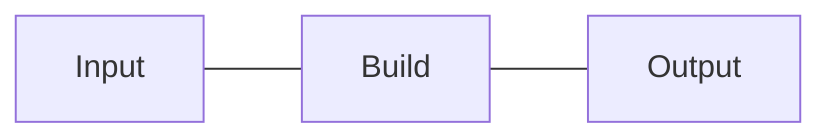

Created Date：2023-09-20 08:52:52  
Last Modified：2023-09-20 08:52:52

# Tags

# Content

## 简介

代码模块 `ESM` 打包工具，将小的代码片段打包成更大、更复杂的代码，如库或应用程序。

## 命令行

```
-c, --config <filename>     使用此配置文件（如果使用参数但未指定值，则默认为 rollup.config.js）
-d, --dir <dirname>         用于块的目录（如果不存在，则打印到 stdout）
-e, --external <ids>        排除模块 ID 的逗号分隔列表
-f, --format <format>       输出类型（amd、cjs、es、iife、umd、system）
-g, --globals <pairs>       `moduleID:Global` 对的逗号分隔列表
-h, --help                  显示此帮助消息
-i, --input <filename>      输入（替代 <entry file>）
-m, --sourcemap             生成源映射（`-m inline` 为内联映射）
-n, --name <name>           UMD 导出的名称
-o, --file <output>         单个输出文件（如果不存在，则打印到 stdout）
-p, --plugin <plugin>       使用指定的插件（可重复）
-v, --version               显示版本号
-w, --watch                 监视产物文件并在更改时重新构建
--amd.autoId                基于块名称生成 AMD ID
--amd.basePath <prefix>     要预先添加到自动生成的 AMD ID 的路径
--amd.define <name>         在 `define` 位置使用的函数
--amd.forceJsExtensionForImports 在 AMD 导入中使用 `.js` 扩展名
--amd.id <id>               AMD 模块的 ID（默认为匿名）
--assetFileNames <pattern>  发布资源的名称模式
--banner <text>             在产物顶部插入的代码（位于包装器之外）
--chunkFileNames <pattern>  发布次要块的名称模式
--compact                   缩小包装器代码
--context <variable>        指定顶级 `this` 值
--no-dynamicImportInCjs     将外部动态 CommonJS 导入编写为 require
--entryFileNames <pattern>  发布入口块的名称模式
--environment <values>      传递给配置文件的设置（请参阅示例）
--no-esModule               不添加 __esModule 属性
--exports <mode>            指定导出模式（auto、default、named、none）
--extend                    扩展由 --name 定义的全局变量
--no-externalImportAssertions 在 "es" 输出中省略导入断言
--no-externalLiveBindings   不生成支持实时绑定的代码
--failAfterWarnings         如果生成的构建产生警告，则退出并显示错误
--filterLogs <filter>       过滤日志信息
--footer <text>             在产物底部插入的代码（位于包装器之外）
--no-freeze                 不冻结命名空间对象
--generatedCode <preset>    使用哪些代码特性（es5/es2015）
--generatedCode.arrowFunctions 在生成的代码中使用箭头函数
--generatedCode.constBindings 在生成的代码中使用 "const"
--generatedCode.objectShorthand 在生成的代码中使用简写属性
--no-generatedCode.reservedNamesAsProps 始终引用保留名称作为 props
--generatedCode.symbols     在生成的代码中使用符号
--no-hoistTransitiveImports 不将中转导入提升到入口块中
--no-indent                 不缩进结果
--inlineDynamicImports      使用动态导入时创建单次打包
--no-interop                不包括交互操作块
--intro <text>              在产物顶部插入的代码（位于包装器内部）
--logLevel <level>          要显示哪种类型的日志
--no-makeAbsoluteExternalsRelative 不规范化外部导入
--maxParallelFileOps <value> 并行读取的文件数
--minifyInternalExports     强制或禁用内部导出的缩小
--noConflict                为 UMD 全局生成 noConflict 方法
--outro <text>              在产物底部插入的代码（位于包装器内部）
--perf                      显示性能计时
--no-preserveEntrySignatures 避免入口点的门面块
--preserveModules           保留模块结构
--preserveModulesRoot       将保留的模块放置在根路径下的此路径下
--preserveSymlinks          解析文件时不要跟随符号链接
--no-sanitizeFileName       不要替换文件名中的无效字符
--shimMissingExports        为丢失的导出创建卡扣变量
--silent                    不打印警告
--sourcemapBaseUrl <url>    使用给定的基本 URL 发出绝对源映射 URL
--sourcemapExcludeSources   在源映射中不包括源代码
--sourcemapFile <file>      指定源映射的包位置
--stdin=ext                 指定用于标准输入的文件扩展名
--no-stdin                  不要从 stdin 读取 "-"
--no-strict                 不在生成的模块中发出 `"use strict";`
--strictDeprecations        抛出有关不推荐使用的功能的错误
--no-systemNullSetters      不要将空的 SystemJS setter 替换为 `null`
--no-treeshake              禁用除屑优化
--no-treeshake.annotations 忽略纯调用注释
--treeshake.correctVarValueBeforeDeclaration 在声明之前将变量取消优化
--treeshake.manualPureFunctions <names> 手动将函数声明为纯函数
--no-treeshake.moduleSideEffects 假设模块没有副作用
--no-treeshake.propertyReadSideEffects 忽略属性访问副作用
--no-treeshake.tryCatchDeoptimization 不要关闭 try-catch-tree-shaking
--no-treeshake.unknownGlobalSideEffects 假设未知的全局变量不会抛出异常
--validate                  验证输出
--waitForBundleInput        等待打包输入文件
--watch.buildDelay <number> 节流观察重建
--no-watch.clearScreen      重建时不要清除屏幕
--watch.exclude <files>     排除要观察的文件
--watch.include <files>     限制观察到指定文件
--watch.onBundleEnd <cmd>   在 "BUNDLE_END" 事件上运行的 Shell 命令
--watch.onBundleStart <cmd> 在 "BUNDLE_START" 事件上运行的 Shell 命令
--watch.onEnd <cmd>         在 "END" 事件上运行的 Shell 命令
--watch.onError <cmd>       在 "ERROR" 事件上运行的 Shell 命令
--watch.onStart <cmd>       在 "START" 事件上运行的 Shell 命令
--watch.skipWrite           在监视时不要将文件写入磁盘
```

## 代码输出插件

## 代码分割

### 代码自动分割

在使用加载耗时较长的功能前，仅加载和解析一次，很有用

### 共享模块

指定多入口点使用的共同模块进行抽离

## 配置文件

```js
export default {
	external: [''], // 作为外部库引入第三方包
}
```

### .cjs 文件 vs .mjs 文件

`commonjs` 模块系统与 `esm` 模块系统 [[../dev/杂/NPM|NPM]]

## 优点

输出结果扁平；  
`tree-shaking`；  
代码可读；

## 缺点

加载 `非ESM` 第三方模块时比较复杂，需要配置一堆插件；  
模块最终打包到一个函数中，不支持 `HMR`；  
浏览器中，代码拆分功能依赖 `AMD`；

## plugins

### @rollup/plugin-node-resolve

`Rollup` 无法处理 `node_modules` 中依赖，该插件采用 `node resolution algorithm` 定位模块，`Rollup` 能够 `node_modules` 中的依赖，并将其打包到输出文件里

```js
// 不配置情况下导入导出
export foo from './foo/index.js'
import bar from './bar/index.js'
```

```js
// 配置情况下导入导出
export foo from './foo'
import bar from './bar'
```

### @rollup/plugin-commonjs

`Rollup` 本身只支持 `ES` 模块，将第三方依赖 `commonjs` 规范开发的模块转为 `ES` 模块，方便打包

### @rollup/plugin-babel

^f9ddaa

[plugins/packages/babel at master · rollup/plugins · GitHub](https://github.com/rollup/plugins/tree/master/packages/babel)  
🍣 A Rollup plugin for seamless integration between Rollup and Babel，无缝整合 `Rollup` 和 `Babel`，使用 `babel` 的功能

```ts
import { babel } from '@rollup/plugin-babel';
const config = {
  input: 'src/index.js',
  output: {
    dir: 'output',
    format: 'es'
  },
  plugins: [babel({ babelHelpers: 'bundled' })]
};

export default config;
```

### @rollup/plugin-json

处理 `json` 导入

### @rollup/plugin-typescript

将 `ts` 转为可在浏览器运行的 `js`，还提供了 `ts` 静态类型检查和编译功能，提高 `ts` 项目开发效率，项目可维护性

### @rollup/plugin-replace

动态替换代码中的特定字符串

### rollup-plugin-visualizer

Visualize and analyze your Rollup bundle to see which modules are taking up space.

## API

### rollup.rollup

### rollup.watch

## 原理



对于一次完整的构建过程而言，`Rollup` 会先进入到 `Build` 阶段，解析各模块的内容及依赖关系，然后进入 `Output` 阶段调用 `bundle` 对象暴露的 `generate` 和 `write` 方法完成打包及输出的过程

### 插件 Hook 类型分类

#### 按阶段

##### build

主要进行模块代码的转换、`AST` 解析以及模块依赖的解析，粒度为模块级别，即单文件级别

##### output

主要进行代码的打包，粒度为 `chunk` 级别（一个 chunk 通常指很多文件打包到一起的产物）

#### 按执行方式

##### Async & Sync

异步和同步的钩子函数

##### Parallel

并行的钩子函数（底层 `Promise.all`）

##### Sequential

适用于插件间处理结果相互依赖的情况

##### First

如果有多个插件实现了这个 `Hook`，那么 `Hook` 将依次运行，直到返回一个 `非null` 或 `非undefined` 的值为止

### 插件开发

[Rollup 开发 | 前端那些事儿](https://jonny-wei.github.io/blog/devops/vite/rollup.html#%E6%8F%92%E4%BB%B6%E5%BC%80%E5%8F%91)

### HMR 原理

[Vite HMR 热更新 | 前端那些事儿](https://jonny-wei.github.io/blog/devops/vite/hmr.html#hmr-%E7%AE%80%E4%BB%8B)

### SSR 工程化实现

[SSR 工程化 | 前端那些事儿](https://jonny-wei.github.io/blog/devops/vite/ssr.html#%E7%90%86%E8%A7%A3-ssr)

## 比较 webpack vs rollup

开发复杂前端应用程序：引入第三方模块 +HMR 功能提高开发效率 + 拆包  
开发类库：优点

新版本的 [[webpack]] 的功能几乎覆盖包含了 `rollup` 的优势点。

## parcel

# Reference

[简介 | Rollup 中文文档](https://cn.rollupjs.org/introduction/)  
[官方|Rollup一站式插件合集](https://github.com/rollup/plugins)

[Rollup 构建中常用插件指南：commonjs、node-resolve、typescript和replace - 掘金](https://juejin.cn/post/7269226884654465081)

[「前端工程化」之 Rollup 上手与基本原理\_哔哩哔哩\_bilibili](https://www.bilibili.com/video/BV1w84y1z77V/?vd_source=032760beb957fcfec470635ca2ed9cef)

[Rollup 集成第三方工具 | rollup.js 中文文档 | rollup.js中文网](https://www.rollupjs.com/guide/tools)  
