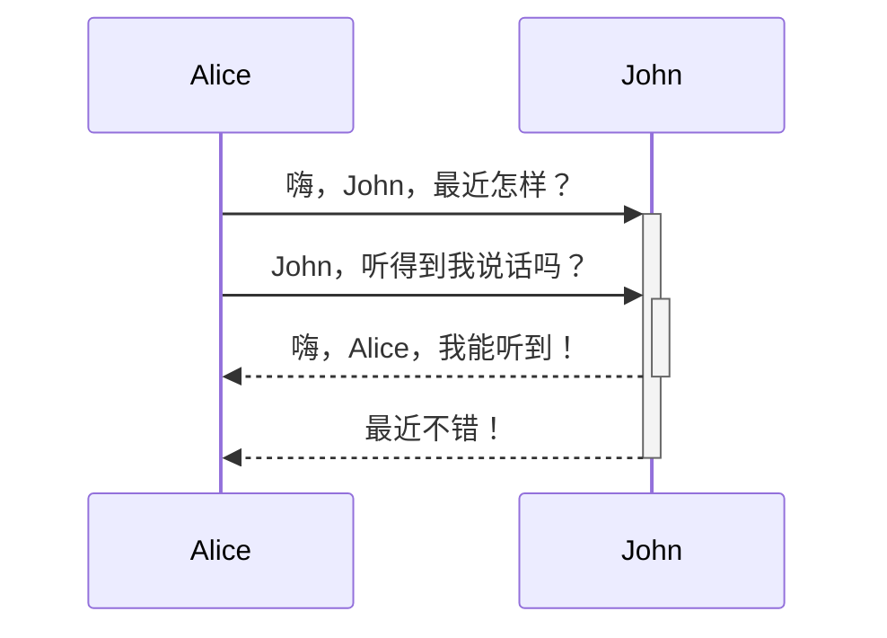

# 目录

- [[#OB使用教程参考文档|OB使用教程参考文档]]
	- [[#官网]]
	- [[#综合教程]]
	- [[#个别插件配置]]
	- [[#在用插件列表]]
	- [[#基础使用]]
	- [[ob手动安装第三方插件]]

# OB 使用教程参考文档

## 官网

[Obsidian](https://obsidian.md/)

## 综合教程

### 官方

[OB中文教程](https://publish.obsidian.md/chinesehelp/01+2021%E6%96%B0%E6%95%99%E7%A8%8B/2021%E5%B9%B4%E6%96%B0%E6%95%99%E7%A8%8B)

### 手动安装第三方插件

[[ob手动安装第三方插件]]

### 少数派

- [玩转 Obsidian 01：打造知识循环利器 - 少数派](https://sspai.com/post/62414)

## 个别插件配置

- [Templater](http://jdev.tw/blog/6484/obsidian-templater-plugin)  
- [更详细的Templater配置说明](https://silentvoid13.github.io/Templater/user-functions/system-user-functions.html)

## 在用插件列表

- https://github.com/platers/obsidian-linter
- https://github.com/guopenghui/obsidian-quiet-outline

## 基础使用

`fuck`  
**fuck**  
*fuck*  
~~fuck~~  
==fuck==

这是一个脚注 [^1]，脚注好用 [^2]

[^1]: 很有用！

[^2]: 当然！
