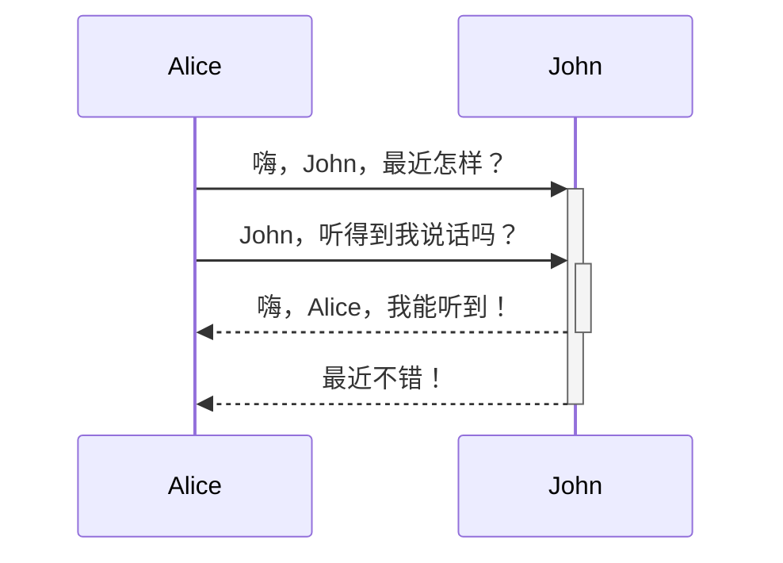

Created Date：2022-12-19 23:11:40  
Lasted Modified：2022-12-19 23:12:07

# Tags

#Obsidian

# Content

## 官网

[Obsidian](https://obsidian.md/)

## 综合教程

### 官方

[OB中文教程](https://publish.obsidian.md/chinesehelp/01+2021%E6%96%B0%E6%95%99%E7%A8%8B/2021%E5%B9%B4%E6%96%B0%E6%95%99%E7%A8%8B)

### 手动安装第三方插件

[[Obsidian 手动安装第三方插件]]

### 少数派

- [玩转 Obsidian 01：打造知识循环利器 - 少数派](https://sspai.com/post/62414)

## 个别插件配置

[[OB 插件之 Templater]]

## 在用插件列表

- https://github.com/platers/obsidian-linter
- https://github.com/guopenghui/obsidian-quiet-outline

## 基础使用

# 标题一

## 标题二

### 标题三

#### 标题四

##### 标题五

###### 标题六

`fuck`  
**fuck**  
*fuck*  
~~fuck~~  
==fuck==

1. a
2. b
3. c

这是一个脚注[^1]，第二个脚注[^2]，第三个脚注[^3]，添加的快捷方式[^4]

# 引用

[^1]: 第一个脚注

[^2]: 第二个脚注

[^3]: 第三个脚注

[^4]: `shift + command + 6`
