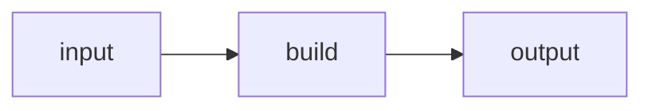

Created Date：2023-11-19 12:18:07  
Last Modified：2023-11-19 12:18:07

# Tags

#前端构建 #前端工程化

# Content

## 常用配置

### 多产物配置

打包 `js` 类库时提供多种不同规范的产物如 `commonjs`、`umd`、`esm`

```js
// rollup.config.js
/**
 * @type { import('rollup').RollupOptions }
 */
const buildOptions = {
  input: ["src/index.js"],
  // 将 output 改造成一个数组
  output: [
    {
      dir: "dist/es",
      format: "esm",
    },
    {
      dir: "dist/cjs",
      format: "cjs",
    },
  ],
};

export default buildOptions;
```

### 多入口配置

```js
{
  input: ["src/index.js", "src/util.js"]
}
// 或者
{
  input: {
    index: "src/index.js",
    util: "src/util.js",
  },
}
```

### 自定义 output 配置

配置输出的相关信息

```js
output: {
  // 产物输出目录
  dir: path.resolve(__dirname, 'dist'),
  // 以下三个配置项都可以使用这些占位符:
  // 1. [name]: 去除文件后缀后的文件名
  // 2. [hash]: 根据文件名和文件内容生成的 hash 值
  // 3. [format]: 产物模块格式，如 es、cjs
  // 4. [extname]: 产物后缀名(带`.`)
  // 入口模块的输出文件名
  entryFileNames: `[name].js`,
  // 非入口模块(如动态 import)的输出文件名
  chunkFileNames: 'chunk-[hash].js',
  // 静态资源文件输出文件名
  assetFileNames: 'assets/[name]-[hash][extname]',
  // 产物输出格式，包括`amd`、`cjs`、`es`、`iife`、`umd`、`system`
  format: 'cjs',
  // 是否生成 sourcemap 文件
  sourcemap: true,
  // 如果是打包出 iife/umd 格式，需要对外暴露出一个全局变量，通过 name 配置变量名
  name: 'MyBundle',
  // 全局变量声明
  globals: {
    // 项目中可以直接用`$`代替`jquery`
    jquery: '$'
  }
}
```

### 依赖 external

```js
{
  external: ['react', 'react-dom']
}
```

排除打包项，外部化，在 SSR 构建或者使用 ESM CDN 的场景中，这个配置将非常有用

### 接入插件 plugins

```js
// rollup.config.js
import resolve from "@rollup/plugin-node-resolve";
import commonjs from "@rollup/plugin-commonjs";

/**
 * @type { import('rollup').RollupOptions }
 */
export default {
  // ...
  // 通过 plugins 参数添加插件
  plugins: [resolve(), commonjs()],
  // ...
};
```

遇到 `Rollup` 本身不支持的场景，比如兼容 CommonJS 打包、注入环境变量、配置路径别名、压缩产物代码等等时，就需要引入相应的 `Rollup` 插件：  

#### [rollup-plugin-node-resolve](https://github.com/rollup/rollup-plugin-node-resolve)

使用该插件，**允许我们加载第三方依赖**，否则像 `import React from 'react'` 的依赖导入语句将不会被 `Rollup` 识别

#### [@rollup/plugin-commonjs](https://github.com/rollup/plugins/tree/master/packages/commonjs)

```js
import commonjs from '@rollup/plugin-commonjs';

export default {
  input: 'src/index.js',
  output: {
    dir: 'output',
    format: 'cjs'
  },
  plugins: [commonjs()]
};
```

该插件的作用是**将 `CommonJS` 格式的代码转换为 `esm` 格式**

#### [@rollup/plugin-json](https://github.com/rollup/plugins/tree/master/packages/json)

```js
import json from '@rollup/plugin-json';

export default {
  input: 'src/index.js',
  output: {
    dir: 'output',
    format: 'cjs'
  },
  plugins: [json()]
};
```

支持 `.json` 的加载，并配合 `rollup` 的 `Tree Shaking` 机制去掉未使用的部分，进行按需打包

#### [@rollup/plugin-babel](https://github.com/rollup/plugins/tree/master/packages/babel)

```js
import { babel } from '@rollup/plugin-babel';

const config = {
  input: 'src/index.js',
  output: {
    dir: 'output',
    format: 'es'
  },
  plugins: [babel({ babelHelpers: 'bundled' })]
};

export default config;
```

在 `Rollup` 中使用 `Babel` 进行 `JS` 代码的语法转译

#### [@rollup/plugin-typescript](https://github.com/rollup/plugins/tree/master/packages/typescript)

```js
// rollup.config.js
import typescript from '@rollup/plugin-typescript';

export default {
  input: 'src/index.ts',
  output: {
    dir: 'output',
    format: 'cjs'
  },
  plugins: [typescript()]
};
```

支持使用 `TypeScript` 开发

#### [@rollup/plugin-alias](https://github.com/rollup/plugins/tree/master/packages/alias)

```js
import alias from '@rollup/plugin-alias';

export default {
  input: 'src/index.js',
  output: {
    dir: 'output',
    format: 'cjs'
  },
  plugins: [
    alias({
      entries: [
        { find: 'utils', replacement: '../../../utils' },
        { find: 'batman-1.0.0', replacement: './joker-1.5.0' }
      ]
    })
  ]
};
```

支持别名配置

#### [@rollup/plugin-replace](https://github.com/rollup/plugins/tree/master/packages/replace)

```js
import replace from '@rollup/plugin-replace';

export default {
  input: 'src/index.js',
  output: {
    dir: 'output',
    format: 'cjs'
  },
  plugins: [
    replace({
      'process.env.NODE_ENV': JSON.stringify('production'),
      __buildDate__: () => JSON.stringify(new Date()),
      __buildVersion: 15
    })
  ]
};
```

在 `Rollup` 进行变量字符串的替换

#### [rollup-plugin-visualizer](https://github.com/btd/rollup-plugin-visualizer)

```js
// es
import { visualizer } from "rollup-plugin-visualizer";
// or
// cjs
const { visualizer } = require("rollup-plugin-visualizer");

module.exports = {
  plugins: [
    // put it the last one
    visualizer(),
  ],
};
```

对 `Rollup` 打包产物进行分析，自动生成产物体积可视化分析图  

  

[[../Project/Rollup|Rollup|插件集合]]

## JavaScript API 方式调用

手动调用 `Rollup API` 主要是 `rollup.rollup` 和 `rollup.watch` 进行打包

### 主要步骤

1. 通过 rollup.rollup 方法，传入 inputOptions，生成 bundle 对象；
2. 调用 bundle 对象的 generate 和 write 方法，传入 outputOptions，分别完成产物和生成和磁盘写入；
3. 调用 bundle 对象的 close 方法来结束打包；

### 代码示例

`rollup.rollup`：

```js
// build.js
const rollup = require("rollup");

// 常用 inputOptions 配置
const inputOptions = {
  input: "./src/index.js",
  external: [],
  plugins:[]
};

const outputOptionsList = [
  // 常用 outputOptions 配置
  {
    dir: 'dist/es',
    entryFileNames: `[name].[hash].js`,
    chunkFileNames: 'chunk-[hash].js',
    assetFileNames: 'assets/[name]-[hash][extname]',
    format: 'es',
    sourcemap: true,
    globals: {
      lodash: '_'
    }
  }
  // 省略其它的输出配置
];

async function build() {
  let bundle;
  let buildFailed = false;
  try {
    // 1. 调用 rollup.rollup 生成 bundle 对象
    bundle = await rollup.rollup(inputOptions);
    for (const outputOptions of outputOptionsList) {
      // 2. 拿到 bundle 对象，根据每一份输出配置，调用 generate 和 write 方法分别生成和写入产物
      const { output } = await bundle.generate(outputOptions);
      await bundle.write(outputOptions);
    }
  } catch (error) {
    buildFailed = true;
    console.error(error);
  }
  if (bundle) {
    // 最后调用 bundle.close 方法结束打包
    await bundle.close();
  }
  process.exit(buildFailed ? 1 : 0);
}

build();
```

`rollup.watch`：

```js
// watch.js
const rollup = require("rollup");

const watcher = rollup.watch({
  // 和 rollup 配置文件中的属性基本一致，只不过多了`watch`配置
  input: "./src/index.js",
  output: [
    {
      dir: "dist/es",
      format: "esm",
    },
    {
      dir: "dist/cjs",
      format: "cjs",
    },
  ],
  watch: {
    exclude: ["node_modules/**"],
    include: ["src/**"],
  },
});

// 监听 watch 各种事件
watcher.on("restart", () => {
  console.log("重新构建…");
});

watcher.on("change", (id) => {
  console.log("发生变动的模块id: ", id);
});

watcher.on("event", (e) => {
  if (e.code === "BUNDLE_END") {
    console.log("打包信息:", e);
  }
});
```

## 插件机制

按需引入插件功能，提高了 `Rollup` 自身的可扩展性

### Rollup 整体构建



**Build 阶段**主要负责创建模块依赖图，初始化各个模块的 `AST` 以及模块之间的依赖关系，经过 Build 阶段的 `bundle` 对象其实并没有进行模块的打包，这个对象的作用在于存储各个模块的内容及依赖关系，同时暴露 generate 和 write 方法；  
**Output 阶段**，真正进行打包，即在 `bundle` 对象的 `generate` 或者 `write` 方法中进行；

### 插件 Hook 类型

#### Build Hook

Build 阶段执行，主要进行==模块代码的转换、AST 解析以及模块依赖的解析==，操作粒度一般为模块级别，也就是单文件级别

#### Ouput Hook

主要进行代码的打包，对于代码而言，操作粒度一般为 chunk 级别 (一个 chunk 通常指很多文件打包到一起的产物)

## 与 webpack 区别

`rollup` 适用于打包 `js` 库，`webpack` 适用于打包大型复杂应用；  
`rollup` 仅支持 `ESM` 模块规范，`webpack` 还支持 `CJS` 模块规范；  
`rollup` 不支持 `HMR`，`webpack` 支持；

## 常用插件

# Reference

[Rollup 打包 | 前端那些事儿](https://jonny-wei.github.io/blog/devops/vite/rollup.html)  
[【前端小知识】Rollup开发一个Npm包，并发布 - 掘金](https://juejin.cn/post/7264044879209529381)  
